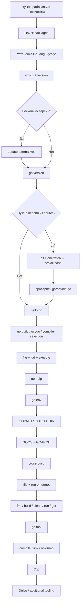
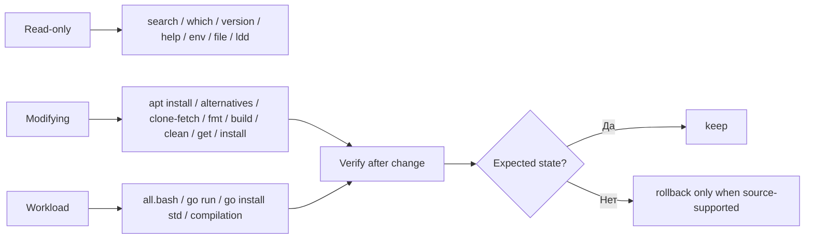

# Diagram — глава 2 «Разворачиваем экосистему Go»

```mermaid
flowchart TD
    A["Нужна рабочая Go-экосистема"] --> B["Поиск packages"]
    B --> C["Установка GoLang / gccgo"]
    C --> D["which + version"]
    D --> E{"Несколько версий?"}
    E -- Да --> F["update-alternatives"]
    F --> G["go version"]
    E -- Нет --> G

    G --> H{"Нужна версия из source?"}
    H -- Да --> I["git clone/fetch → src/all.bash"]
    I --> J["проверить goroot/bin/go"]
    H -- Нет --> K["hello.go"]
    J --> K

    K --> L["go build / gccgo / compiler selection"]
    L --> M["file + ldd + execute"]

    M --> N["go help"]
    N --> O["go env"]
    O --> P["GOPATH / GOTOOLDIR"]
    P --> Q["GOOS + GOARCH"]
    Q --> R["cross-build"]
    R --> S["file + run on target"]

    S --> T["fmt / build / clean / run / get"]
    T --> U["go tool"]
    U --> V["compile / link / objdump"]
    V --> W["Cgo"]
    W --> X["Delve / additional tooling"]
```

## Safety overlay

```mermaid
flowchart LR
    R["Read-only"] --> R1["search / which / version / help / env / file / ldd"]
    M["Modifying"] --> M1["apt install / alternatives / clone-fetch / fmt / build / clean / get / install"]
    W["Workload"] --> W1["all.bash / go run / go install std / compilation"]
    M1 --> V["Verify after change"]
    W1 --> V
    V --> K{"Expected state?"}
    K -- Да --> Keep["keep"]
    K -- Нет --> RB["rollback only when source-supported"]
```
