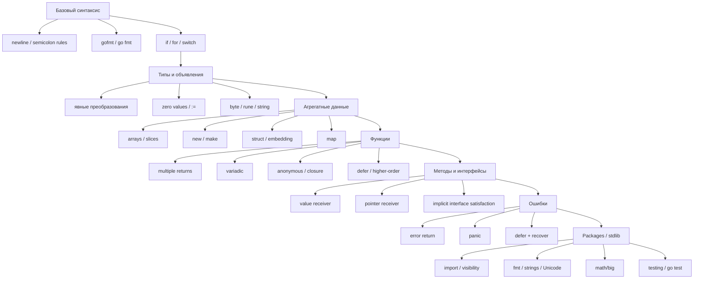
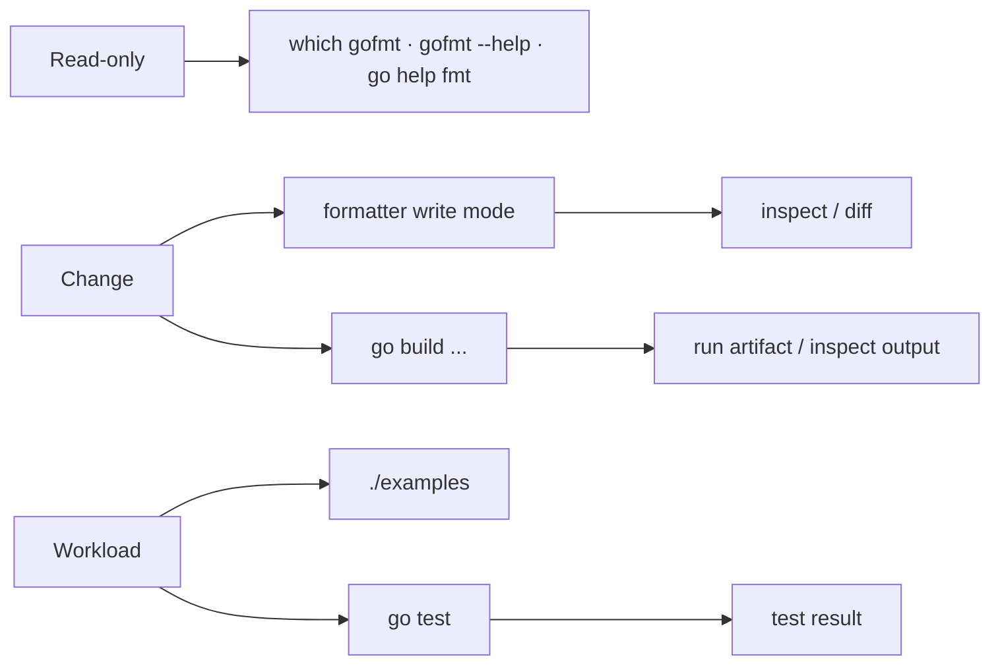

# Diagram — глава 3 «Неформально о синтаксисе Go»

```mermaid
flowchart TD
    A["Базовый синтаксис"] --> A1["newline / semicolon rules"]
    A --> A2["gofmt / go fmt"]
    A --> A3["if / for / switch"]

    A3 --> B["Типы и объявления"]
    B --> B1["явные преобразования"]
    B --> B2["zero values / :="]
    B --> B3["byte / rune / string"]

    B --> C["Агрегатные данные"]
    C --> C1["arrays / slices"]
    C --> C2["new / make"]
    C --> C3["struct / embedding"]
    C --> C4["map"]

    C --> D["Функции"]
    D --> D1["multiple returns"]
    D --> D2["variadic"]
    D --> D3["anonymous / closure"]
    D --> D4["defer / higher-order"]

    D --> E["Методы и интерфейсы"]
    E --> E1["value receiver"]
    E --> E2["pointer receiver"]
    E --> E3["implicit interface satisfaction"]

    E --> F["Ошибки"]
    F --> F1["error return"]
    F --> F2["panic"]
    F --> F3["defer + recover"]

    F --> G["Packages / stdlib"]
    G --> G1["import / visibility"]
    G --> G2["fmt / strings / Unicode"]
    G --> G3["math/big"]
    G --> G4["testing / go test"]
```

## Operational split

```mermaid
flowchart LR
    RO["Read-only"] --> H["which gofmt · gofmt --help · go help fmt"]
    CH["Change"] --> FMT["formatter write mode"]
    CH --> BUILD["go build ..."]
    WL["Workload"] --> RUN["./examples"]
    WL --> TEST["go test"]

    FMT --> V["inspect / diff"]
    BUILD --> V2["run artifact / inspect output"]
    TEST --> V3["test result"]
```
