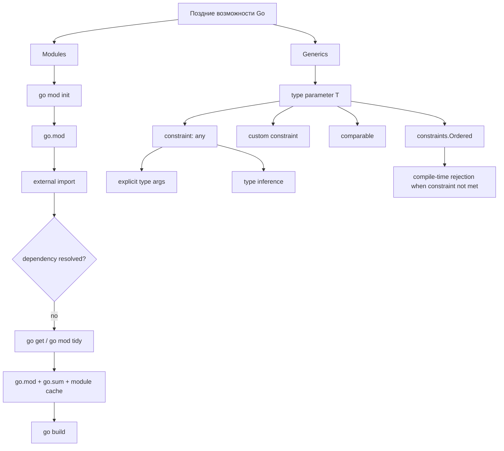
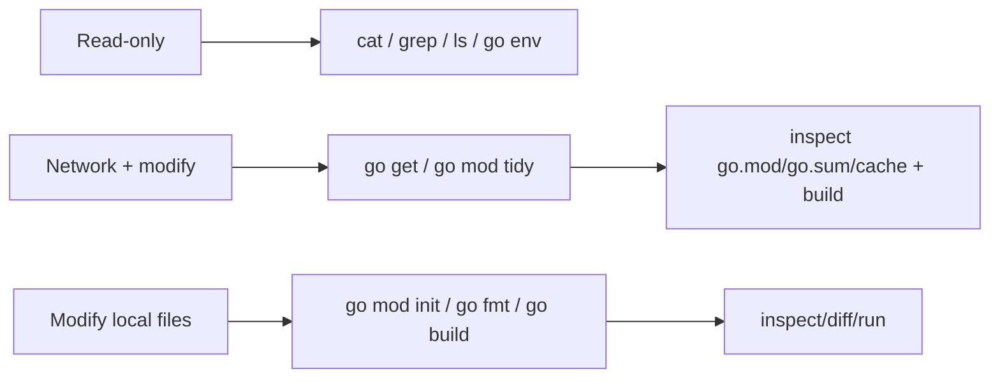

# Diagram — глава 4 «Новости от последних версий...»

```mermaid
flowchart TD
    A["Поздние возможности Go"] --> M["Modules"]
    A --> G["Generics"]

    M --> M1["go mod init"]
    M1 --> M2["go.mod"]
    M2 --> M3["external import"]
    M3 --> M4{"dependency resolved?"}
    M4 -- no --> M5["go get / go mod tidy"]
    M5 --> M6["go.mod + go.sum + module cache"]
    M6 --> M7["go build"]

    G --> G1["type parameter T"]
    G1 --> G2["constraint: any"]
    G2 --> G3["explicit type args"]
    G2 --> G4["type inference"]
    G1 --> G5["custom constraint"]
    G1 --> G6["comparable"]
    G1 --> G7["constraints.Ordered"]
    G7 --> G8["compile-time rejection when constraint not met"]
```

## Operational safety map

```mermaid
flowchart LR
    RO["Read-only"] --> R1["cat / grep / ls / go env"]
    NET["Network + modify"] --> N1["go get / go mod tidy"]
    MOD["Modify local files"] --> M1["go mod init / go fmt / go build"]
    N1 --> V["inspect go.mod/go.sum/cache + build"]
    M1 --> V2["inspect/diff/run"]
```
