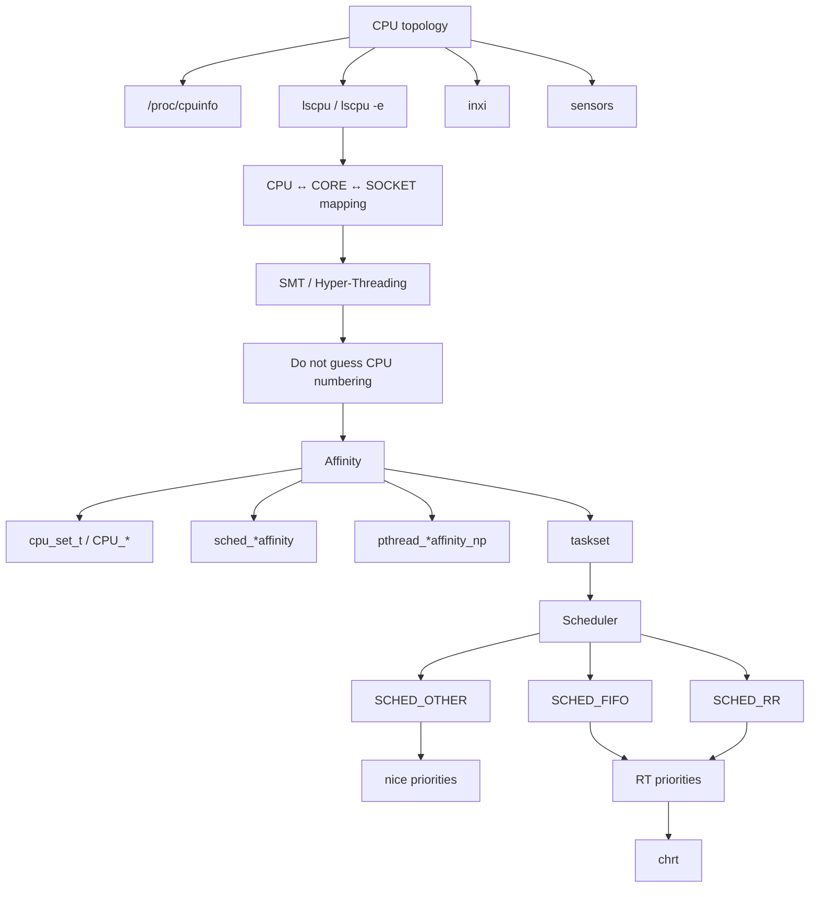
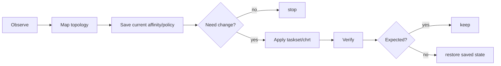

# Diagram — глава 5 «Процессоры в Linux»

```mermaid
flowchart TD
    A["CPU topology"] --> A1["/proc/cpuinfo"]
    A --> A2["lscpu / lscpu -e"]
    A --> A3["inxi"]
    A --> A4["sensors"]

    A2 --> B["CPU ↔ CORE ↔ SOCKET mapping"]
    B --> C["SMT / Hyper-Threading"]
    C --> D["Do not guess CPU numbering"]

    D --> E["Affinity"]
    E --> E1["cpu_set_t / CPU_*"]
    E --> E2["sched_*affinity"]
    E --> E3["pthread_*affinity_np"]
    E --> E4["taskset"]

    E4 --> F["Scheduler"]
    F --> F1["SCHED_OTHER"]
    F --> F2["SCHED_FIFO"]
    F --> F3["SCHED_RR"]

    F1 --> G["nice priorities"]
    F2 --> H["RT priorities"]
    F3 --> H
    H --> I["chrt"]
```

## Operational path

```mermaid
flowchart LR
    O["Observe"] --> M["Map topology"]
    M --> S["Save current affinity/policy"]
    S --> C{"Need change?"}
    C -- no --> END["stop"]
    C -- yes --> A["Apply taskset/chrt"]
    A --> V["Verify"]
    V --> OK{"Expected?"}
    OK -- yes --> KEEP["keep"]
    OK -- no --> RB["restore saved state"]
```
