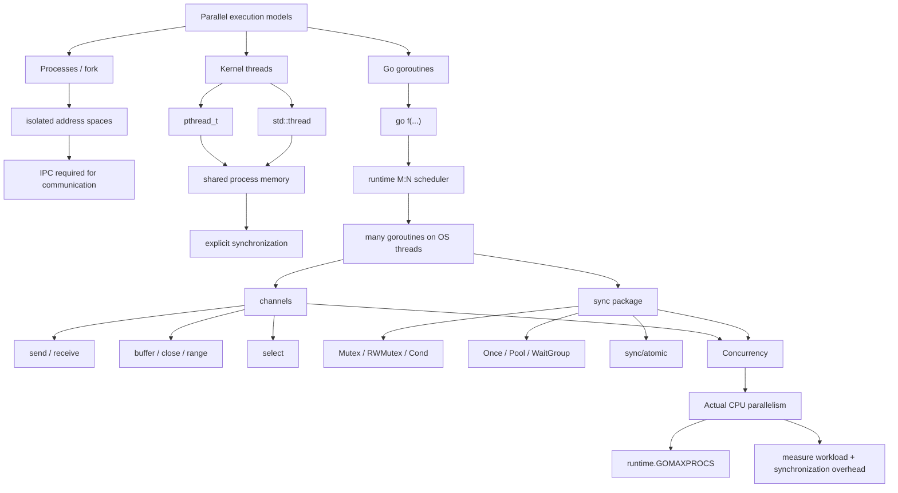
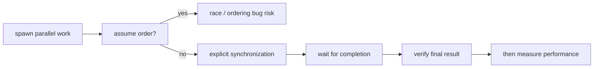

# Diagram — глава 6 «Параллелизм и многопроцессорность»

```mermaid
flowchart TD
    A["Parallel execution models"] --> P["Processes / fork"]
    A --> T["Kernel threads"]
    A --> G["Go goroutines"]

    P --> P1["isolated address spaces"]
    P1 --> P2["IPC required for communication"]

    T --> T1["pthread_t"]
    T --> T2["std::thread"]
    T1 --> T3["shared process memory"]
    T2 --> T3
    T3 --> S["explicit synchronization"]

    G --> G1["go f(...)"]
    G1 --> G2["runtime M:N scheduler"]
    G2 --> G3["many goroutines on OS threads"]

    G3 --> C["channels"]
    C --> C1["send / receive"]
    C --> C2["buffer / close / range"]
    C --> C3["select"]

    G3 --> SY["sync package"]
    SY --> SY1["Mutex / RWMutex / Cond"]
    SY --> SY2["Once / Pool / WaitGroup"]
    SY --> SY3["sync/atomic"]

    C --> CP["Concurrency"]
    SY --> CP
    CP --> PAR["Actual CPU parallelism"]
    PAR --> GP["runtime.GOMAXPROCS"]
    PAR --> B["measure workload + synchronization overhead"]
```

## Correctness path

```mermaid
flowchart LR
    START["spawn parallel work"] --> ND["assume order?"]
    ND -- yes --> BUG["race / ordering bug risk"]
    ND -- no --> SYNC["explicit synchronization"]
    SYNC --> WAIT["wait for completion"]
    WAIT --> CHECK["verify final result"]
    CHECK --> PERF["then measure performance"]
```
