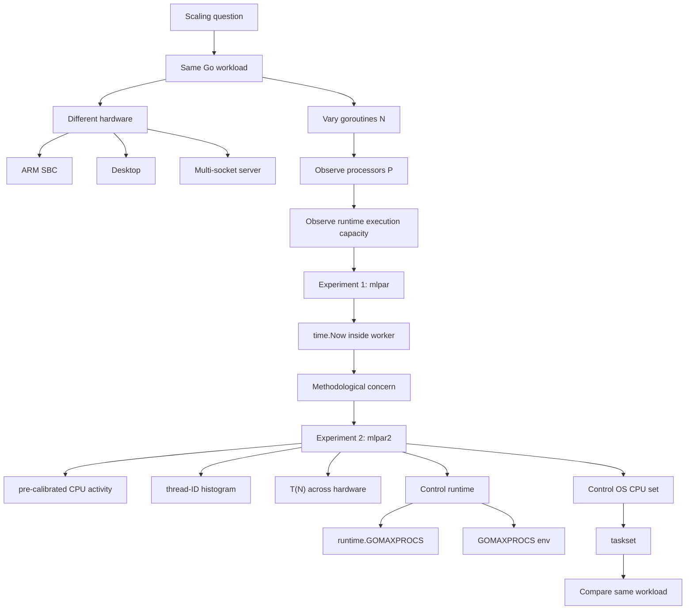
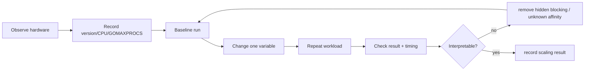

# Diagram — глава 7 «Масштабирование»

```mermaid
flowchart TD
    A["Scaling question"] --> B["Same Go workload"]
    B --> C["Different hardware"]
    C --> C1["ARM SBC"]
    C --> C2["Desktop"]
    C --> C3["Multi-socket server"]

    B --> D["Vary goroutines N"]
    D --> E["Observe processors P"]
    E --> F["Observe runtime execution capacity"]

    F --> G["Experiment 1: mlpar"]
    G --> G1["time.Now inside worker"]
    G1 --> H["Methodological concern"]

    H --> I["Experiment 2: mlpar2"]
    I --> I1["pre-calibrated CPU activity"]
    I --> I2["thread-ID histogram"]
    I --> I3["T(N) across hardware"]

    I --> J["Control runtime"]
    J --> J1["runtime.GOMAXPROCS"]
    J --> J2["GOMAXPROCS env"]

    I --> K["Control OS CPU set"]
    K --> K1["taskset"]
    K1 --> L["Compare same workload"]
```

## Verification flow

```mermaid
flowchart LR
    O["Observe hardware"] --> V["Record version/CPU/GOMAXPROCS"]
    V --> B["Baseline run"]
    B --> C["Change one variable"]
    C --> R["Repeat workload"]
    R --> X["Check result + timing"]
    X --> Q{"Interpretable?"}
    Q -- no --> FIX["remove hidden blocking / unknown affinity"]
    FIX --> B
    Q -- yes --> KEEP["record scaling result"]
```
