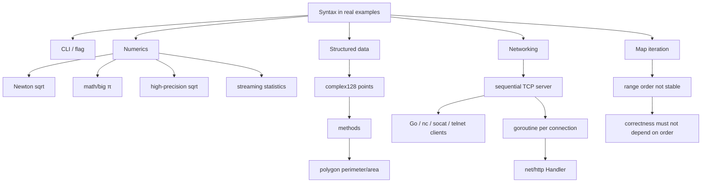
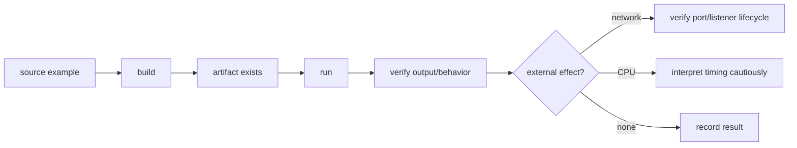

# Diagram — глава 8 «Осваиваемся в синтаксисе Go»

```mermaid
flowchart TD
    A["Syntax in real examples"] --> CLI["CLI / flag"]
    A --> NUM["Numerics"]
    A --> DATA["Structured data"]
    A --> NET["Networking"]
    A --> MAP["Map iteration"]

    NUM --> N1["Newton sqrt"]
    NUM --> N2["math/big π"]
    NUM --> N3["high-precision sqrt"]
    NUM --> N4["streaming statistics"]

    DATA --> D1["complex128 points"]
    D1 --> D2["methods"]
    D2 --> D3["polygon perimeter/area"]

    NET --> S1["sequential TCP server"]
    S1 --> C1["Go / nc / socat / telnet clients"]
    S1 --> S2["goroutine per connection"]
    S2 --> HTTP["net/http Handler"]

    MAP --> M1["range order not stable"]
    M1 --> M2["correctness must not depend on order"]
```

## Operational path

```mermaid
flowchart LR
    SRC["source example"] --> B["build"]
    B --> A["artifact exists"]
    A --> R["run"]
    R --> V["verify output/behavior"]
    V --> Q{"external effect?"}
    Q -- network --> P["verify port/listener lifecycle"]
    Q -- CPU --> T["interpret timing cautiously"]
    Q -- none --> DONE["record result"]
```
