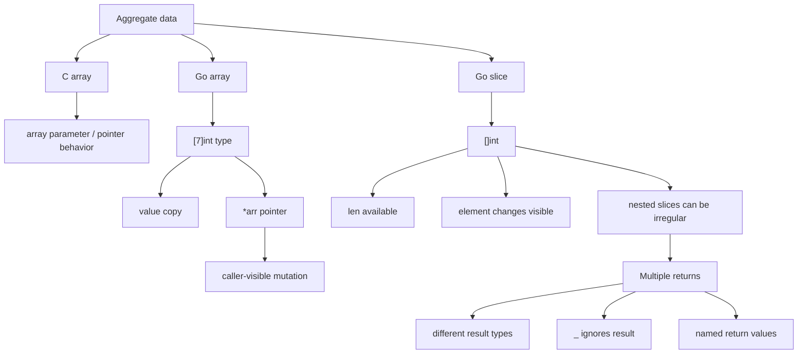
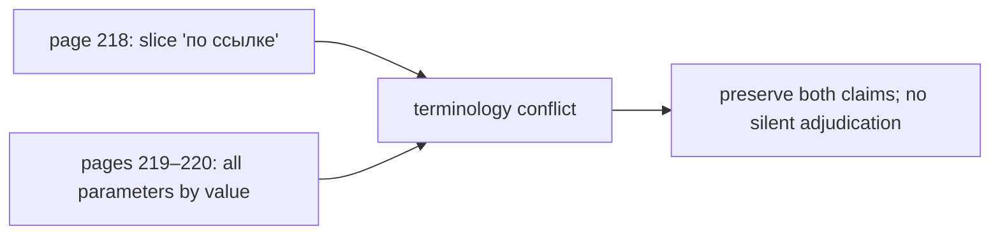

# Diagram — глава 9 «Структуры данных, типы и их методы»

```mermaid
flowchart TD
    A["Aggregate data"] --> C["C array"]
    A --> GA["Go array"]
    A --> GS["Go slice"]

    C --> C1["array parameter / pointer behavior"]

    GA --> GA1["[7]int type"]
    GA1 --> GA2["value copy"]
    GA1 --> GA3["*arr pointer"]
    GA3 --> GA4["caller-visible mutation"]

    GS --> GS1["[]int"]
    GS1 --> GS2["len available"]
    GS1 --> GS3["element changes visible"]
    GS1 --> GS4["nested slices can be irregular"]

    GS4 --> MR["Multiple returns"]
    MR --> MR1["different result types"]
    MR --> MR2["_ ignores result"]
    MR --> MR3["named return values"]
```

## Source ambiguity overlay

```mermaid
flowchart LR
    S1["page 218: slice 'по ссылке'"] --> X["terminology conflict"]
    S2["pages 219–220: all parameters by value"] --> X
    X --> RULE["preserve both claims; no silent adjudication"]
```
