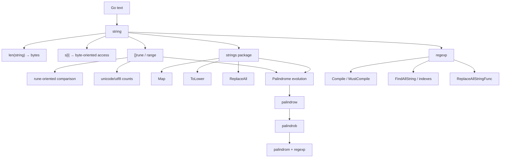
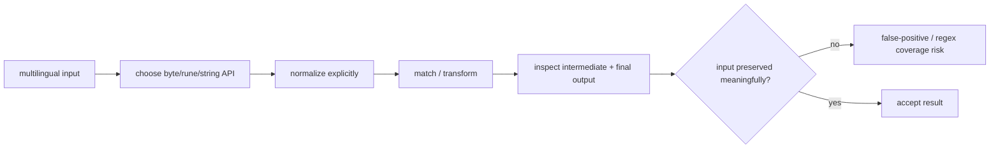

# Diagram — глава 10 «Строки, руны и UNICODE»

```mermaid
flowchart TD
    A["Go text"] --> B["string"]
    B --> B1["len(string) → bytes"]
    B --> B2["s[i] → byte-oriented access"]
    B --> R["[]rune / range"]
    R --> R1["rune-oriented comparison"]
    R --> R2["unicode/utf8 counts"]

    B --> S["strings package"]
    S --> S1["Map"]
    S --> S2["ToLower"]
    S --> S3["ReplaceAll"]

    R --> P["Palindrome evolution"]
    S --> P
    P --> P1["palindrow"]
    P1 --> P2["palindrob"]
    P2 --> P3["palindrom + regexp"]

    B --> RE["regexp"]
    RE --> RE1["Compile / MustCompile"]
    RE --> RE2["FindAllString / indexes"]
    RE --> RE3["ReplaceAllStringFunc"]
```

## Verification flow

```mermaid
flowchart LR
    I["multilingual input"] --> E["choose byte/rune/string API"]
    E --> N["normalize explicitly"]
    N --> M["match / transform"]
    M --> V["inspect intermediate + final output"]
    V --> Q{"input preserved meaningfully?"}
    Q -- no --> BUG["false-positive / regex coverage risk"]
    Q -- yes --> OK["accept result"]
```
