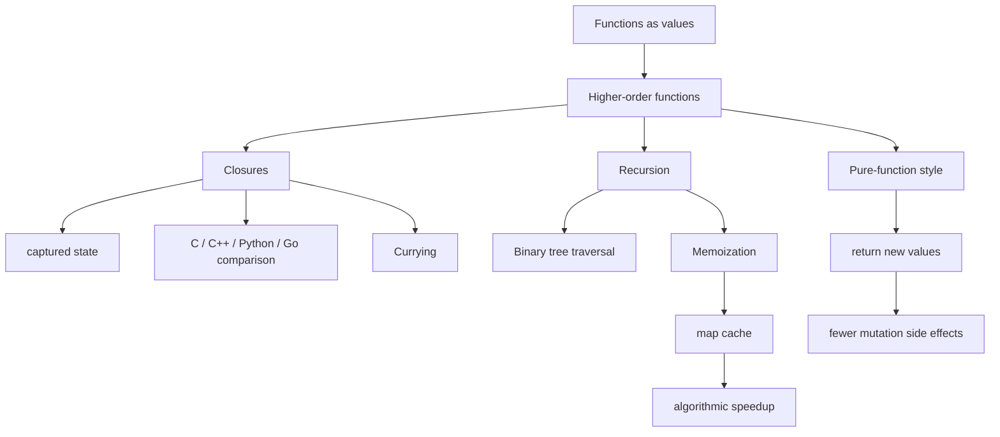
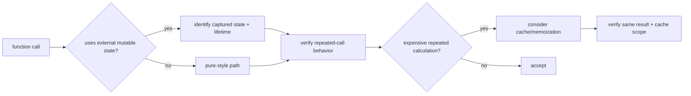

# Diagram — глава 11 «Элементы функционального программирования»

```mermaid
flowchart TD
    A["Functions as values"] --> H["Higher-order functions"]
    H --> C["Closures"]
    C --> C1["captured state"]
    C --> CMP["C / C++ / Python / Go comparison"]

    C --> CUR["Currying"]
    H --> REC["Recursion"]
    REC --> TREE["Binary tree traversal"]
    REC --> MEM["Memoization"]
    MEM --> CACHE["map cache"]
    CACHE --> PERF["algorithmic speedup"]

    H --> PURE["Pure-function style"]
    PURE --> IMM["return new values"]
    IMM --> SAFE["fewer mutation side effects"]
```

## State reasoning

```mermaid
flowchart LR
    F["function call"] --> Q{"uses external mutable state?"}
    Q -- yes --> S["identify captured state + lifetime"]
    Q -- no --> P["pure-style path"]
    S --> V["verify repeated-call behavior"]
    P --> V
    V --> M{"expensive repeated calculation?"}
    M -- yes --> C["consider cache/memoization"]
    M -- no --> DONE["accept"]
    C --> R["verify same result + cache scope"]
```
