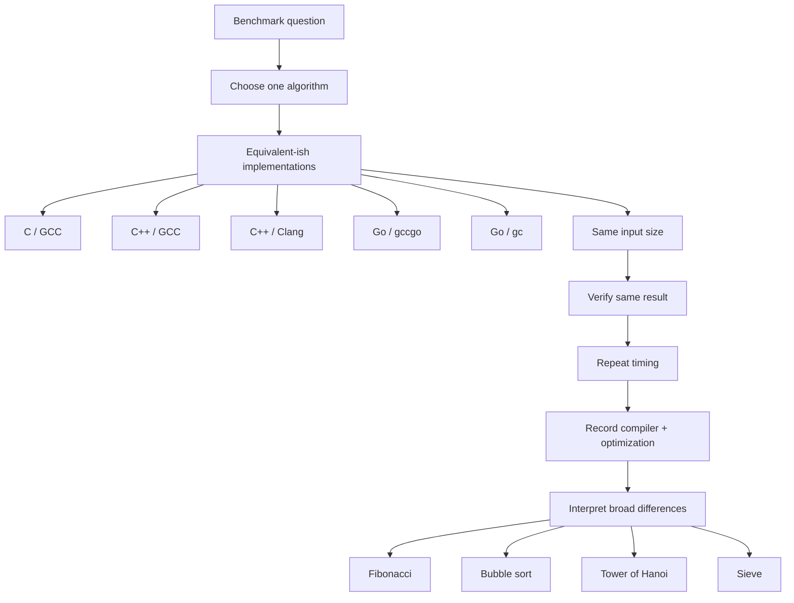
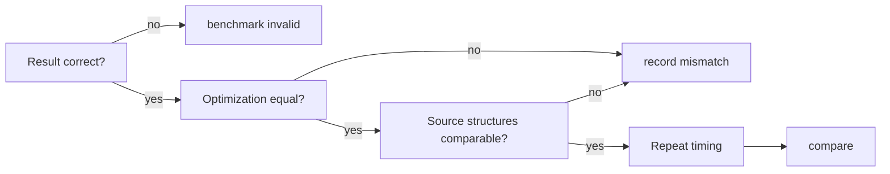

# Diagram — глава 12 «Скоростные и другие сравнения языков»

```mermaid
flowchart TD
    A["Benchmark question"] --> B["Choose one algorithm"]
    B --> C["Equivalent-ish implementations"]
    C --> C1["C / GCC"]
    C --> C2["C++ / GCC"]
    C --> C3["C++ / Clang"]
    C --> C4["Go / gccgo"]
    C --> C5["Go / gc"]

    C --> D["Same input size"]
    D --> E["Verify same result"]
    E --> F["Repeat timing"]
    F --> G["Record compiler + optimization"]
    G --> H["Interpret broad differences"]

    H --> I["Fibonacci"]
    H --> J["Bubble sort"]
    H --> K["Tower of Hanoi"]
    H --> L["Sieve"]
```

## Measurement gate

```mermaid
flowchart LR
    R["Result correct?"] -->|no| STOP["benchmark invalid"]
    R -->|yes| O["Optimization equal?"]
    O -->|no| NOTE["record mismatch"]
    O -->|yes| S["Source structures comparable?"]
    S -->|no| NOTE
    S -->|yes| T["Repeat timing"]
    T --> C["compare"]
```
