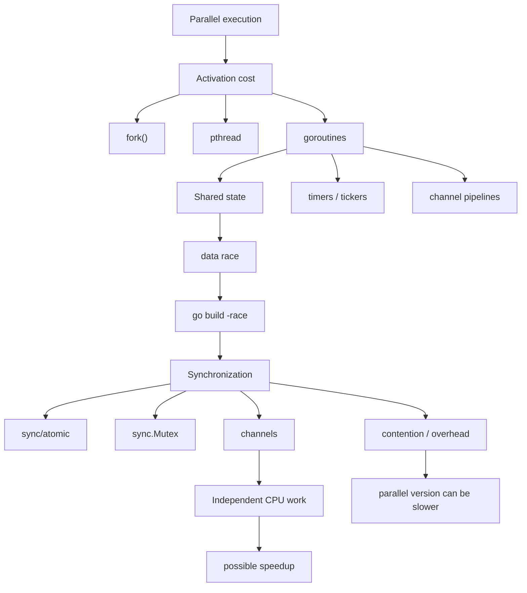
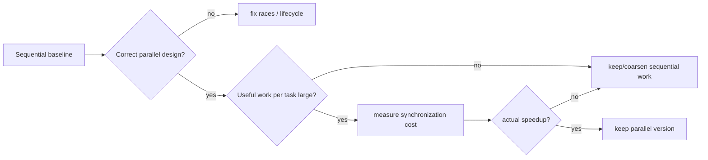

# Diagram — глава 13 «Многопроцессорные параллельные вычисления»

```mermaid
flowchart TD
    A["Parallel execution"] --> ACT["Activation cost"]
    ACT --> P["fork()"]
    ACT --> T["pthread"]
    ACT --> G["goroutines"]

    G --> R["Shared state"]
    R --> RACE["data race"]
    RACE --> DET["go build -race"]

    DET --> FIX["Synchronization"]
    FIX --> AT["sync/atomic"]
    FIX --> MU["sync.Mutex"]
    FIX --> CH["channels"]

    CH --> SCALE["Independent CPU work"]
    SCALE --> GOOD["possible speedup"]

    FIX --> CONT["contention / overhead"]
    CONT --> BAD["parallel version can be slower"]

    G --> TM["timers / tickers"]
    G --> PIPE["channel pipelines"]
```

## Parallelization decision

```mermaid
flowchart LR
    S["Sequential baseline"] --> C{"Correct parallel design?"}
    C -- no --> STOP["fix races / lifecycle"]
    C -- yes --> W{"Useful work per task large?"}
    W -- no --> SEQ["keep/coarsen sequential work"]
    W -- yes --> M["measure synchronization cost"]
    M --> G{"actual speedup?"}
    G -- yes --> KEEP["keep parallel version"]
    G -- no --> SEQ
```
