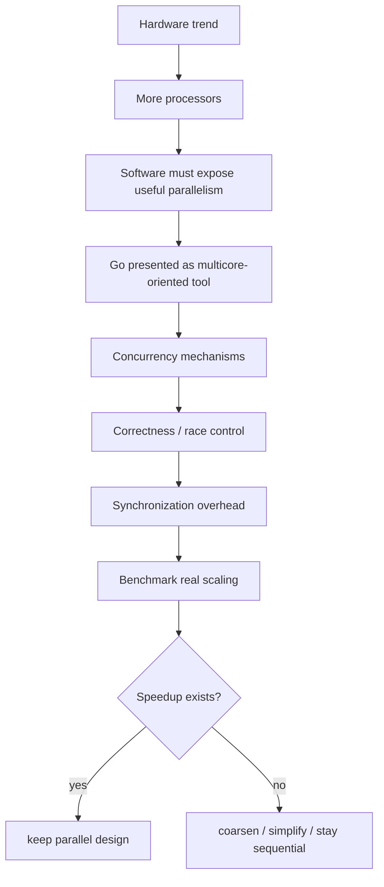

# Diagram — «Заключение»


```mermaid
flowchart TD
    H["Hardware trend"] --> M["More processors"]
    M --> S["Software must expose useful parallelism"]
    S --> G["Go presented as multicore-oriented tool"]
    G --> C["Concurrency mechanisms"]
    C --> R["Correctness / race control"]
    R --> O["Synchronization overhead"]
    O --> B["Benchmark real scaling"]
    B --> Q{"Speedup exists?"}
    Q -- yes --> KEEP["keep parallel design"]
    Q -- no --> REDESIGN["coarsen / simplify / stay sequential"]
```

## Book-level invariant

```text
architecture opportunity
→ parallel design
→ correctness
→ measurement
→ only then performance claim
```
