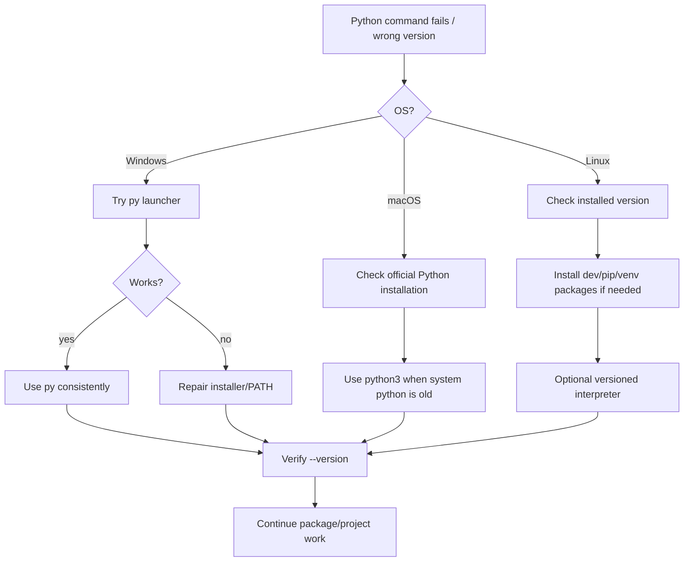

# Диаграмма — приложение А

```mermaid
flowchart TD
    A["Python command fails / wrong version"] --> B{"OS?"}
    B -->|Windows| C["Try py launcher"]
    C --> D{"Works?"}
    D -->|yes| E["Use py consistently"]
    D -->|no| F["Repair installer/PATH"]
    B -->|macOS| G["Check official Python installation"]
    G --> H["Use python3 when system python is old"]
    B -->|Linux| I["Check installed version"]
    I --> J["Install dev/pip/venv packages if needed"]
    J --> K["Optional versioned interpreter"]
    E --> L["Verify --version"]
    F --> L
    H --> L
    K --> L
    L --> M["Continue package/project work"]
```
