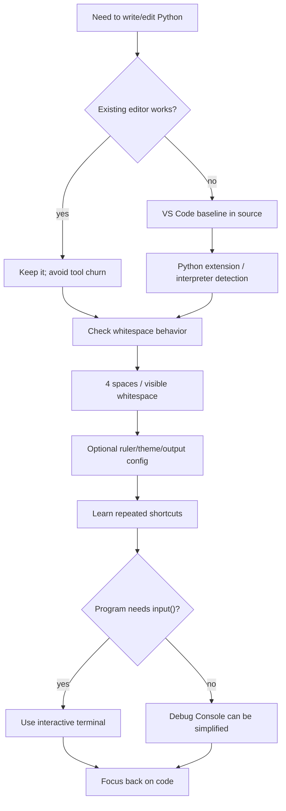

# Диаграмма — приложение Б

```mermaid
flowchart TD
    A["Need to write/edit Python"] --> B{"Existing editor works?"}
    B -- yes --> C["Keep it; avoid tool churn"]
    B -- no --> D["VS Code baseline in source"]
    D --> E["Python extension / interpreter detection"]
    C --> F["Check whitespace behavior"]
    E --> F
    F --> G["4 spaces / visible whitespace"]
    G --> H["Optional ruler/theme/output config"]
    H --> I["Learn repeated shortcuts"]
    I --> J{"Program needs input()?"}
    J -- yes --> K["Use interactive terminal"]
    J -- no --> L["Debug Console can be simplified"]
    K --> M["Focus back on code"]
    L --> M
```
