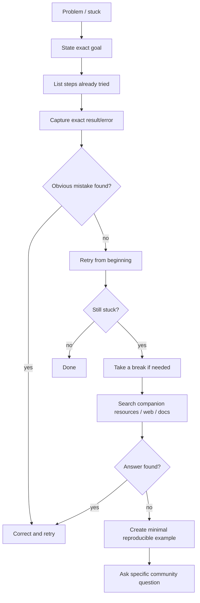

# Диаграмма — приложение В

```mermaid
flowchart TD
    A["Problem / stuck"] --> B["State exact goal"]
    B --> C["List steps already tried"]
    C --> D["Capture exact result/error"]
    D --> E{"Obvious mistake found?"}
    E -- yes --> F["Correct and retry"]
    E -- no --> G["Retry from beginning"]
    G --> H{"Still stuck?"}
    H -- no --> I["Done"]
    H -- yes --> J["Take a break if needed"]
    J --> K["Search companion resources / web / docs"]
    K --> L{"Answer found?"}
    L -- yes --> F
    L -- no --> M["Create minimal reproducible example"]
    M --> N["Ask specific community question"]
```
