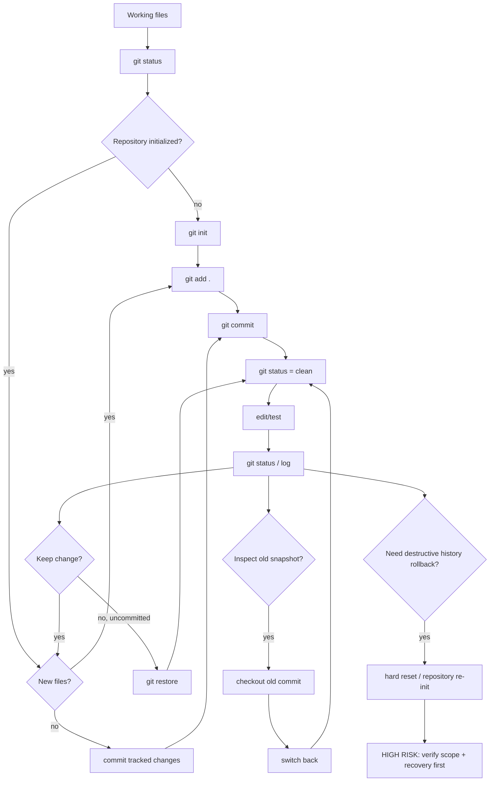

# Диаграмма — приложение Г

```mermaid
flowchart TD
    A["Working files"] --> B["git status"]
    B --> C{"Repository initialized?"}
    C -- no --> D["git init"]
    D --> E["git add ."]
    C -- yes --> F{"New files?"}
    F -- yes --> E
    F -- no --> G["commit tracked changes"]
    E --> H["git commit"]
    G --> H
    H --> I["git status = clean"]
    I --> J["edit/test"]
    J --> K["git status / log"]
    K --> L{"Keep change?"}
    L -- yes --> F
    L -- no, uncommitted --> M["git restore"]
    M --> I
    K --> N{"Inspect old snapshot?"}
    N -- yes --> O["checkout old commit"]
    O --> P["switch back"]
    P --> I
    K --> Q{"Need destructive history rollback?"}
    Q -- yes --> R["hard reset / repository re-init"]
    R --> S["HIGH RISK: verify scope + recovery first"]
```
