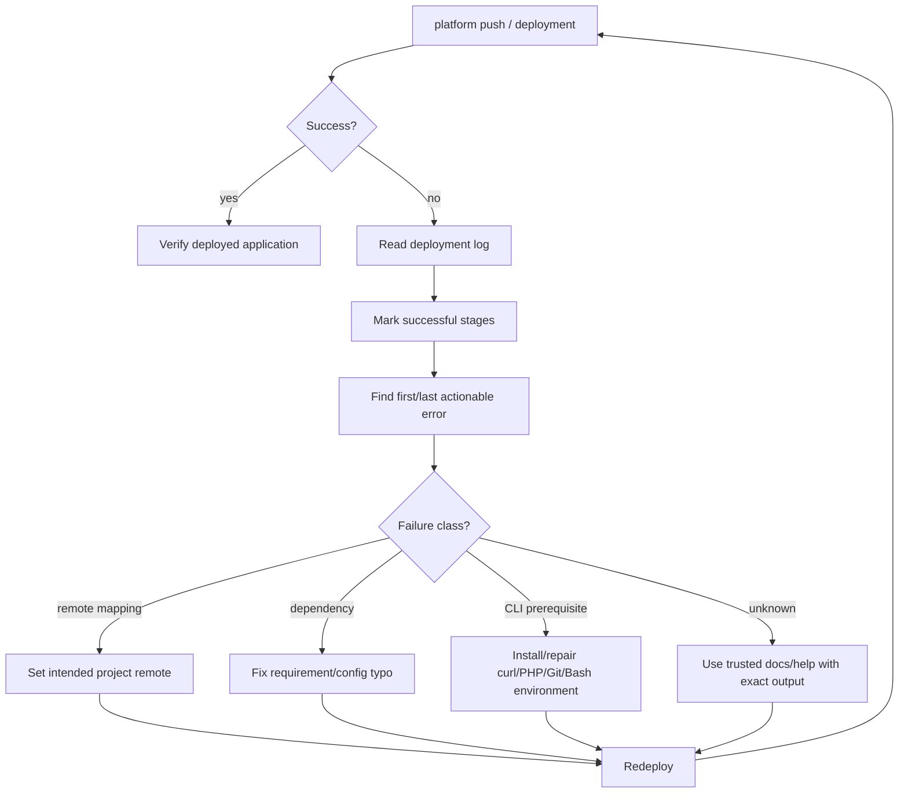
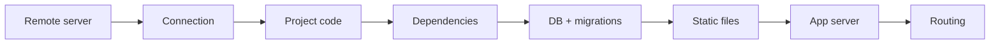

# Диаграмма — приложение Д

```mermaid
flowchart TD
    A["platform push / deployment"] --> B{"Success?"}
    B -- yes --> C["Verify deployed application"]
    B -- no --> D["Read deployment log"]
    D --> E["Mark successful stages"]
    E --> F["Find first/last actionable error"]
    F --> G{"Failure class?"}
    G -->|remote mapping| H["Set intended project remote"]
    G -->|dependency| I["Fix requirement/config typo"]
    G -->|CLI prerequisite| J["Install/repair curl/PHP/Git/Bash environment"]
    G -->|unknown| K["Use trusted docs/help with exact output"]
    H --> L["Redeploy"]
    I --> L
    J --> L
    K --> L
    L --> A
```

## Deployment stage model

```mermaid
flowchart LR
    S["Remote server"] --> C["Connection"]
    C --> P["Project code"]
    P --> D["Dependencies"]
    D --> DB["DB + migrations"]
    DB --> ST["Static files"]
    ST --> W["App server"]
    W --> R["Routing"]
```
